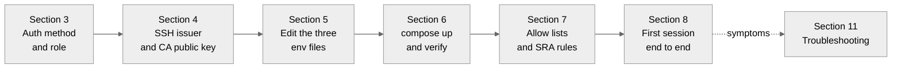

# Akeyless SRA with Gateway on Docker Runbook

An operator runbook for installing and running Akeyless Secure Remote Access, SRA, beside an Akeyless Gateway on a single Docker host, using Docker Compose. The reader has a Docker host and an Akeyless account, and wants SSH, RDP, database, and web sessions proxied through one gateway deployment. The runbook prepares the account side, configures the Compose project, starts the stack, wires access control, opens a first session, and covers day two operations.

Every step below follows the official Akeyless documentation; the source pages are linked at the end. Where the documentation offers two variants, the runbook picks one and says so.

The Docker Compose deployment supports a subset of the Kubernetes configuration options. Akeyless positions it for evaluation, demos, and small pilots. For production workloads, use the Kubernetes path in the Akeyless documentation.

## Table of Contents

| # | Section | Description |
|---|---|---|
| 1 | [What Gets Deployed](#1-what-gets-deployed) | Services, ports, network, profiles |
| 2 | [Prerequisites](#2-prerequisites) | Host sizing, Docker versions, connectivity, exposure rules |
| 3 | [Prepare the Account Side](#3-prepare-the-account-side) | Authentication method, role, gateway admins |
| 4 | [Prepare the SSH Certificate Issuer](#4-prepare-the-ssh-certificate-issuer) | Signer key, issuer, CA public key export |
| 5 | [Configure the Compose Project](#5-configure-the-compose-project) | Clone, `gateway.env`, `sra.env`, `cache.env`, CA mount |
| 6 | [Start and Verify](#6-start-and-verify) | Profiles, container inventory, health check |
| 7 | [Access Control](#7-access-control) | The three permission layers on Docker |
| 8 | [First Session End to End](#8-first-session-end-to-end) | Enable SRA on the issuer, connect by CLI and portal |
| 9 | [Running and Operating](#9-running-and-operating) | Restarts, upgrades, logs, metrics, TLS |
| 10 | [Advanced Configuration](#10-advanced-configuration) | Keepalives, fingerprints, layouts, recordings |
| 11 | [Troubleshooting](#11-troubleshooting) | Symptom table for deployment and sessions |

## Deployment path at a glance



Sections 3 and 4 are account side only and can run in parallel. Section 5 consumes outputs from both.

## 1. What Gets Deployed

The Compose file starts four containers on one Docker bridge network, `internal-net`. Only the gateway and the SSH bastion need published ports.

| Service | Container | Ports | Purpose |
|---|---|---|---|
| Akeyless Gateway | `akeyless-gateway` | 8000 published, 8080 published, 8889 optional | API, console, SRA portal on 8000; health and internal API on 8080; metrics on 8889 |
| SRA Web bastion | `akeyless-sra-web` | 8888 | RDP streams, database web clients, web access handoffs |
| SRA SSH bastion | `akeyless-sra-ssh` | 2222 published as 22, 9900 internal | SSH certificate sessions and the bastion control API |
| Redis cache | `akeyless-cache` | 6379 internal | Cache and session support; required for SRA |

The services are grouped by Compose profiles: `gateway`, `sra`, and `metrics`. The `sra` profile pulls in the gateway and the cache as dependencies, so a single command starts the full stack. The `metrics` profile adds Prometheus on 9090 and Grafana on 3000 and is optional.

The gateway fronts the user facing paths on port 8000. Users open the console at `/console` and the SRA portal at `/sra/portal`; the bastions handle session traffic behind the scenes. The SSH bastion runs in privileged mode, which the requirements page lists as mandatory for SRA runtime behavior.

## 2. Prerequisites

- Docker Engine 20.10 or higher, and Docker Compose 1.29 or higher, on a Linux or Windows host.
- Minimum 1 vCPU and 2 GB RAM for the gateway, plus 1 vCPU and 2 GiB memory per SRA component. The web and SSH bastions are two components, so the full stack needs at least 3 vCPU and 6 GiB beyond the cache footprint.
- Outbound connectivity from the host to Akeyless SaaS Core Services, and to session recording storage when RDP recording is configured.
- The host firewall must open the published ports to the internal network only. Port 8000 carries the console, the API, and the portal, and must never be globally exposed. The gateway itself needs only outbound connections to Akeyless SaaS.

Publish port 2222 to the network your SSH users reach, and keep 8888, 9900, and 6379 on the internal network unless a component in front of them needs more.

Redis is a hard dependency for SRA components. A gateway-only deployment can skip the cache; an SRA deployment cannot. The Compose file ships the cache with both profiles.

The default deployment serves plain HTTP. The Akeyless public console at `console.akeyless.io` cannot manage a gateway without TLS. Section 9 covers TLS and the scope of the HTTP default.

## 3. Prepare the Account Side

The gateway authenticates to your Akeyless account with one authentication method. Create a dedicated API key for it; the docs recommend the gateway identity hold permissions to create and manage items and targets only.

```shell
akeyless auth-method create api-key --name SraGatewayKey
akeyless create-role --name SraGatewayRole
akeyless set-role-rule --role-name SraGatewayRole --path "/sra/*" --capability read --capability list --capability create --capability update
akeyless set-role-rule --role-name SraGatewayRole --path "/sra/*" --rule-type target-rule --capability read --capability list
akeyless assoc-role-am --role-name SraGatewayRole --am-name SraGatewayKey
```

Record the `Access ID` and `Access Key` from the new method. They feed `gateway.env` in section 5.

`GATEWAY_ACCESS_TYPE` is mandatory for SRA deployments. API key authentication sets it to `access_key`. The supported types for the Compose deployment are `access_key`, `k8s`, `azure_ad`, `aws_iam`, `universal_identity`, `gcp`, and `cert`. Cloud identity types authenticate the container through the host's cloud role and need no access key; the runbook uses `access_key` because it works on any host.

Decide who administers the gateway console. The `ALLOWED_ACCESS_PERMISSIONS` variable takes a JSON list of access permissions:

```shell
ALLOWED_ACCESS_PERMISSIONS='[{"name": "Administrators", "access_id": "p-yyyyyy", "sub_claims": {"email": ["admin@example.com"]}, "permissions": ["admin"]}]'
```

Without sub-claims, every user of that authentication method gains admin on the gateway. With an API key entry, provide just the access ID, a name, and permissions. This variable controls console administration only; section 7 separates it from the session path.

## 4. Prepare the SSH Certificate Issuer

SRA SSH access works through short lived certificates signed by an Akeyless RSA key. The SSH bastion needs the public half at startup to verify incoming certificates, and users connect through an issuer that signs with the private half.

Create the signer key and the issuer:

```shell
akeyless create-dfc-key -n /sra/SSHSignerKey -a RSA2048
akeyless create-ssh-cert-issuer \
  --name /sra/SSHCertIssuer \
  --signer-key-name /sra/SSHSignerKey \
  --allowed-users 'ubuntu' \
  --ttl 300
```

`--allowed-users` constrains which OS account names a certificate may carry. Use the real OS user on your target host. The TTL of 300 seconds is the quick start default; raise it for longer sessions but keep it short enough to limit a leaked certificate.

Export the signer public key in OpenSSH format:

```shell
akeyless get-rsa-public --name /sra/SSHSignerKey --json --jq-expression='.ssh'
```

The output is one `ssh-rsa ...` line. Save it as `ca.pub` next to your Compose files; section 5 mounts it into the SSH bastion. Target hosts must also trust this key through `TrustedUserCAKeys /etc/ssh/ca.pub` in `sshd_config`, then a service restart.

## 5. Configure the Compose Project

Clone the official Compose repository:

```shell
gh repo clone akeylesslabs/docker-compose
cd docker-compose
```

Four files drive the deployment:

- `docker-compose.yaml` defines the services.
- `gateway.env` configures the gateway.
- `sra.env` configures the SRA components.
- `cache.env` stores the Redis password.

The sample Compose layout published alongside the Akeyless documentation names the cache container `redis-cache` and reads the password from a Docker secret instead of `cache.env`. Either layout works; keep the `REDIS_ADDR` value consistent with whichever cache name your file uses.

### gateway.env

Set at minimum:

```shell
CLUSTER_NAME="<meaningful-cluster-name>"
GATEWAY_ACCESS_ID="p-*********"
GATEWAY_ACCESS_TYPE="access_key"
GATEWAY_ACCESS_KEY="<access-key>"
ALLOWED_ACCESS_PERMISSIONS='[{"name": "Administrators", "access_id": "p-yyyyyy", "permissions": ["admin"]}]'
```

The variables in play:

| Variable | Required | Purpose |
|---|---|---|
| `CLUSTER_NAME` | Yes | Cluster identity, paired with the access ID. Changing either creates an entirely new gateway instance |
| `GATEWAY_ACCESS_ID` | Yes | Access ID of the gateway authentication method |
| `GATEWAY_ACCESS_TYPE` | Yes | One of `access_key`, `k8s`, `azure_ad`, `aws_iam`, `universal_identity`, `gcp`, `cert` |
| `GATEWAY_ACCESS_KEY` | For `access_key` | Matching access key |
| `ALLOWED_ACCESS_PERMISSIONS` | Recommended | JSON list of console administrators and their permissions |
| `UNIFIED_GATEWAY` | Yes for SRA | Set `true`; adds the SRA personas to the gateway |
| `REMOTE_ACCESS_WEB_SERVICE_INTERNAL_URL` | Set by default | `http://akeyless-web:8888`; adjust only if you rename the web container |
| `REMOTE_ACCESS_SSH_SERVICE_INTERNAL_URL` | Set by default | `http://akeyless-ssh:9900`; adjust only if you rename the SSH container |
| `REDIS_ADDR` | Set by default | Cache address, `akeyless-cache:6379` in the upstream file |
| `VERSION` | Optional | Pins a gateway image version instead of `latest` |
| `ENABLE_METRICS` | Optional | Set `true` to expose metrics on 8889 |

Set the cluster name to something meaningful before the first start. The pair of access ID and cluster name identifies the gateway instance in your account; a later rename starts a fresh instance without the settings of the old one.

### sra.env

The defaults fit the upstream Compose file. Confirm these three:

```shell
UNIFIED_GATEWAY="true"
GATEWAY_URL=http://akeyless-gateway:8000
REMOTE_ACCESS_SSH_ENDPOINT=akeyless-ssh:22
```

`GATEWAY_URL` and `REMOTE_ACCESS_SSH_ENDPOINT` use container names on the internal network, so they change only when you rename services.

### cache.env

SRA requires the cluster cache, and the cache requires a password:

```shell
REDIS_PASS=<strong-password>
```

Replace the shipped placeholder before the first start; the stack fails to come up healthy without it.

### Mount the CA public key

For SSH access, mount the public key exported in section 4 into the SSH bastion. Edit the `akeyless-ssh` volumes in `docker-compose.yaml`:

```yaml
volumes:
  - ./ssh-config/:/var/akeyless/creds/
```

Place `ca.pub` inside `./ssh-config/`. The documentation also shows a direct file mount, `- /path/to/ca.pub:/var/akeyless/creds/ca.pub`; either form delivers the same file to the bastion.

## 6. Start and Verify

From the directory holding the Compose files:

```shell
docker compose --profile gateway --profile sra up -d
```

The `sra` profile starts the cache, the gateway, and both bastions. Verify the container inventory:

```shell
docker ps
```

Four containers should run: `akeyless-gateway`, `akeyless-cache`, `akeyless-sra-web`, and `akeyless-sra-ssh`.

Check the gateway health endpoint:

```shell
curl -f http://localhost:8080/health
```

An HTTP 200 response confirms the gateway is up. The bastions wait for the gateway health check before starting, so a healthy gateway with both bastions running is the signal the stack is ready.

Then open the console at `http://<docker-host>:8000/console` and the SRA portal at `http://<docker-host>:8000/sra/portal`. Console login uses the administrators from `ALLOWED_ACCESS_PERMISSIONS`; portal login follows the rules in section 8.

## 7. Access Control

Three independent layers gate SRA on Docker. A session needs the right caller at the transport layer, the right SRA rule on the item, and the right list membership where lists are set.

| Layer | Variable or rule | Controls |
|---|---|---|
| Privileged identity | `GATEWAY_ACCESS_ID` | The gateway's own account identity |
| Console administrators | `ALLOWED_ACCESS_PERMISSIONS` | Who may manage the gateway configuration |
| Transport allowlist | `GATEWAY_AUTHORIZED_ACCESS_ID` | Which access IDs can call the gateway API at all |
| Session grants | `--rule-type sra-rule` | Which roles may open sessions on which paths |

Two variables sound similar and do different jobs. `ALLOWED_ACCESS_PERMISSIONS` decides who administers the gateway console. `GATEWAY_AUTHORIZED_ACCESS_ID` decides which callers the gateway serves at all, enforced at the transport layer before any permission check; leave it unset to serve every access ID, or set a comma-separated list to restrict the audience. The gateway's own access ID is always allowed.

Session grants use the SRA rule type. For a user role over the issuer path:

```shell
akeyless set-role-rule --role-name SraUsers \
  --path "/sra/SSHCertIssuer" \
  --capability list --capability allow_access
```

Item read permissions alone never grant sessions. Grant the ordinary item rule and the SRA rule together:

```shell
akeyless set-role-rule --role-name SraUsers --path "/sra/*" --capability read --capability list
akeyless set-role-rule --role-name SraUsers --path "/sra/*" --rule-type sra-rule --capability allow_access
```

Capabilities beyond `allow_access`: `request_access` requires approval before a session, `justify_access_only` demands a justification text at launch, `approval_authority` lets a role approve requests from others, and a user can never approve their own request.

A complete first user:

```shell
akeyless auth-method create api-key --name SraUsersKey
akeyless create-role --name SraUsers
akeyless set-role-rule --role-name SraUsers --path "/sra/*" --capability read --capability list
akeyless set-role-rule --role-name SraUsers --path "/sra/*" --rule-type target-rule --capability read --capability list
akeyless set-role-rule --role-name SraUsers --path "/sra/*" --rule-type sra-rule --capability allow_access
akeyless assoc-role-am --role-name SraUsers --am-name SraUsersKey
```

## 8. First Session End to End

This section opens one SSH session to a target host, following the connecting-your-first-resource guide. The same three preparation steps apply to every later resource type.

### Allow the path to the target

Open outbound traffic from the Docker host to the target on port 22, and allow inbound traffic on the target from the host's address or subnet range. Skipping this step leaves every later step looking correctly configured while the connection times out.

### Enable SRA on the issuer

In the console: **Items**, locate `/sra/SSHCertIssuer`, **Secure Remote Access**, then **Edit**. Check **Enable Secure Remote Access**, click **Add** and enter the target host's address, set **Default SSH Username** to the OS user from `--allowed-users`, and save.

The CLI equivalent sets the same block explicitly:

```shell
akeyless update-ssh-cert-issuer \
  --name /sra/SSHCertIssuer \
  --secure-access-enable true \
  --secure-access-host <target-host> \
  --secure-access-ssh-creds-user ubuntu
```

On Docker the bastion endpoints come from the environment files: `REMOTE_ACCESS_SSH_SERVICE_INTERNAL_URL` points the gateway at the bastion control API, and `REMOTE_ACCESS_SSH_ENDPOINT` points it at the SSH listener. You set both in section 5, so the issuer needs only the target and the username.

### Connect with the CLI

Authenticate as the SRA user and connect:

```shell
akeyless auth --access-id <user-access-id> --access-key <user-access-key>
```

```shell
akeyless connect \
  -t "ubuntu@<target-host>:22" \
  -c /sra/SSHCertIssuer \
  -v <docker-host>:2222 \
  -g http://<docker-host>:8000 \
  --token <t-token>
```

Where:

- `-t` is the OS user and target, matching the issuer's allowed users and host list.
- `-c` is the certificate issuer with SRA enabled.
- `-v` is the published SSH bastion endpoint. Docker maps host port 2222 to the bastion's 22.
- `-g` is the gateway base URL the CLI authenticates against.
- `--token` is the t-token printed by `akeyless auth`.

Landing in a shell on the target with the banner "You are connecting to your remote server via Akeyless Bastion" confirms the full chain: CLI, gateway, issuer, bastion, target.

### Use the portal

The internal portal runs at `http://<docker-host>:8000/sra/portal`. Portal sign-in requires SAML, OIDC, or certificate authentication; LDAP works on the internal portal only. An API key user therefore connects through the CLI, as above, while an IdP-backed user works through the portal.

The public portal at `https://zerotrust.akeyless.io` also serves this gateway. To use it for web or RDP sessions, register the gateway's web endpoint under your account: `http://<docker-host>:8000/sra/web-client`.

Once signed in, the portal lists every item with SRA enabled, and sessions open from there with just-in-time credentials.

## 9. Running and Operating

### Apply configuration changes

The env files are read at container creation. After editing them, recreate the affected services:

```shell
docker compose --profile gateway --profile sra up -d
```

Compose recreates the containers whose configuration changed and leaves the rest running.

### Upgrade the gateway

The gateway container fetches its application version at startup, so the documented upgrade path is a restart:

```shell
docker restart akeyless-gateway
```

The container restarts, pulls the version resolved from `VERSION`, or the current release when `VERSION` is unset, and rejoins the existing cluster instance. When the base image itself must change, recreate instead:

```shell
docker compose pull akeyless-gateway
docker compose --profile gateway --profile sra up -d
```

Reuse the same `GATEWAY_ACCESS_ID` and `CLUSTER_NAME` across either path. The pair identifies the gateway instance, so the replacement retrieves the settings and data of the old one. Pin `VERSION` in `gateway.env` when you need a specific release instead of `latest`.

### Logs

```shell
docker logs -f akeyless-gateway
docker logs -f akeyless-sra-ssh
docker logs -f akeyless-sra-web
```

The bastions default to `DEBUG: true` in the Compose file. Reduce the verbosity once the deployment is stable.

### Metrics

Set `ENABLE_METRICS=true` in `gateway.env` and start the monitoring stack:

```shell
docker compose --profile metrics up -d
```

Prometheus lands on 9090 and Grafana on 3000, scraping the gateway's metrics endpoint on 8889.

### TLS

The default stack serves HTTP, which suits an internal lab behind a trusted boundary. For anything stronger, configure TLS before opening the gateway to a wider network: set `ENABLE_TLS`, `ENABLE_TLS_CONFIGURE`, and related variables, and mount the certificate and key into the gateway container, following the Gateway Docker Advanced Configuration page. The public console at `console.akeyless.io` requires TLS and cannot manage a plain HTTP gateway.

## 10. Advanced Configuration

The settings below come from the Docker Compose advanced configuration page. The gateway-side ones use the `gateway update remote-access` CLI against the gateway URL.

### SSH session liveness

Keep long sessions alive across idle networks by setting these in `sra.env`:

```shell
SSH_CLIENT_ALIVE_INTERVAL=120
SSH_CLIENT_ALIVE_COUNT_MAX=2
SSH_SERVER_ALIVE_INTERVAL=120
SSH_SERVER_ALIVE_COUNT_MAX=2
```

### SSH host key fingerprints

Set `SSH_HOST_KEYS_PATH` in `sra.env` to an account folder path, for example `/sra/host-keys`. The bastion then stores accepted fingerprints in your account instead of asking users to re-accept them after restarts. The gateway authentication method needs `create`, `read`, and `list` on that folder.

### Keyboard layouts and algorithms

```shell
akeyless gateway update remote-access --keyboard-layout de-de-qwertz --gateway-url http://<docker-host>:8000
akeyless gateway update remote-access --kexalgs curve25519-sha256 --gateway-url http://<docker-host>:8000
akeyless gateway update remote-access --legacy-ssh-algorithm true --gateway-url http://<docker-host>:8000
```

The layout default is `en-us-qwerty`. The legacy algorithm flag signs certificates with `ssh-rsa-cert-v01@openssh.com` for old SSH servers.

### Redirect hardening

For Docker-based SSH bastion deployments, set `ALLOWED_BASTION_URLS` to the URLs valid for redirection from the public Zero Trust Portal back to your bastion. Non-allowed user-provided endpoints are dropped from client state.

### Session recording and forwarding

RDP sessions record to S3 or Azure Blob through `gateway update remote-access-rdp-recording`. Local storage keeps recordings inside the gateway container under `/home/akeyless/recordings`; mount a persistent volume on that path, because container storage is lost on recreation. CLI input and output forwarding is configured through `gateway update remote-access-session-forwarding`.

### Non-default account regions

Accounts outside the default region, for example MEU, need the bastion authentication service endpoint set explicitly through `UAM_ADDR`. When RDP sessions close right after successful authentication and the logs stay quiet, check the `UAM_ADDR` value against your account region first.

## 11. Troubleshooting

| Symptom | Likely cause | Fix |
|---|---|---|
| Stack fails to start, cache exits | `REDIS_PASS` left at the placeholder | Set a real password in `cache.env` and recreate |
| Gateway unhealthy at `http://localhost:8080/health` | Wrong `GATEWAY_ACCESS_ID`, `GATEWAY_ACCESS_KEY`, or `GATEWAY_ACCESS_TYPE` | Verify the credentials with `akeyless auth`, then correct `gateway.env` |
| Bastions restart in a loop | The gateway health check never passes | Resolve the gateway issue first; the bastions depend on it |
| SSH bastion cannot verify certificates | `ca.pub` missing from the mount | Confirm `./ssh-config/ca.pub` exists and the volume maps to `/var/akeyless/creds/` |
| `akeyless connect` times out | Target unreachable from the Docker host, or port 2222 not published to the user network | Open the host-to-target path on port 22 and check the 2222 mapping |
| Permission denied when the session opens | OS user missing from the issuer's `--allowed-users`, or the default username on the issuer differs | Align both with the real OS user on the target |
| Portal rejects the login | Portal requires SAML, OIDC, or certificate auth; API keys are CLI only | Use an IdP-backed method for the portal, or connect with the CLI |
| Sessions work but a caller is rejected outright | `GATEWAY_AUTHORIZED_ACCESS_ID` set without the caller's access ID | Add the access ID to the list, or unset the variable to serve all callers |
| Public console cannot see the gateway | Gateway serves plain HTTP | Configure TLS per section 9, or manage through the local console |
| RDP session closes right after login | Region mismatch between the account and `UAM_ADDR` | Align `UAM_ADDR` with the account region |

## Scope and Limits

This runbook covers the unified gateway Compose deployment: the gateway with its web and SSH bastion personas, direct connections, RDP, database web clients, and SSH certificate sessions. Isolated browsing and secure web proxy through a dedicated ZTWA dispatcher and worker pair are a separate Docker Compose deployment, covered by the Zero Trust Web Access on Docker page. The Kubernetes path with Helm is covered separately in the Akeyless documentation.

## Sources

- [SRA on Docker Compose](https://docs.akeyless.io/docs/sra-docker)
- [Gateway Docker Compose Deployment](https://docs.akeyless.io/docs/gateway-deploy-docker-compose)
- [Gateway Docker Advanced Configuration](https://docs.akeyless.io/docs/gateway-docker-advanced-configuration)
- [SRA Requirements](https://docs.akeyless.io/docs/sra-requirements)
- [SRA Quick Start Guide](https://docs.akeyless.io/docs/sra-quick-start-guide)
- [Connecting Your First SRA Resource](https://docs.akeyless.io/docs/connecting-your-first-sra-resource)
- [Docker Compose Advanced Configuration](https://docs.akeyless.io/docs/sra-advanced-configuration-docker)
- [Zero Trust Web Access on Docker](https://docs.akeyless.io/docs/sra-web-access-docker)
- Upstream repository: [`akeylesslabs/docker-compose`](https://github.com/akeylesslabs/docker-compose)
