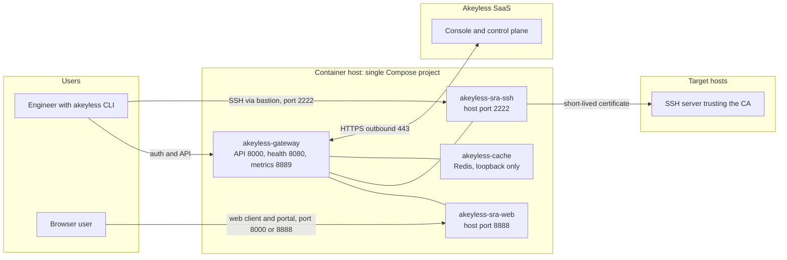

# Akeyless Secure Remote Access on Compose: Runbook

This repository is a self-contained, end-to-end runbook for deploying Akeyless
Secure Remote Access (SRA) with the Akeyless Gateway on a single Compose host.
It ships a ready-to-use Compose kit plus eleven chapters that carry you from
an empty Linux host to your first SSH session through the bastion, with
verification at every step. You do not need any other document to complete the
deployment: every prerequisite, command, value, and fix lives in this
repository.

The runbook has two runtime streams, Docker and Podman. Seven chapters apply
to both runtimes and live once in `docs/common/`. Four chapters, 2, 6, 9, and
11, exist once per runtime: `docs/docker/` is written entirely with Docker
Engine and Compose v2 commands, `docs/podman/` entirely with rootful Podman
commands. Follow one stream from start to finish; you never need to read the
other.

## Pick your stream

- **Docker Engine 20.10 or newer with Compose v2:** start at
  [docs/docker/README.md](docs/docker/README.md).
- **Podman 4.9 or newer, rootful, with a Compose v2 provider:** start at
  [docs/podman/README.md](docs/podman/README.md).

Both streams run the identical Compose kit from `compose/`.

## What problem this solves

SSH access to infrastructure usually means long-lived keys copied onto laptops
and bastion hosts, with no per-session control and no audit trail. Akeyless SRA
replaces that with short-lived SSH certificates. Users authenticate to Akeyless
once, receive a certificate valid for minutes, and connect through the SRA
bastion. Sessions are logged, approvable, and revocable.

| Capability | How this deployment provides it |
|---|---|
| Short-lived SSH credentials | SSH Certificate Issuer with a 5 minute default TTL, chapter 4 |
| Brokered SSH access | SSH bastion container on host port 2222, chapter 6 |
| Browser-based SSH and RDP | Web bastion container on host port 8888, chapter 8 |
| Per-user permissions | Roles and SRA rules in the Akeyless account, chapter 7 |
| Session audit and approval | Gateway logs and approval flows, chapters 7 and 9 |

## Documents

Seven shared chapters, read in either stream:

| # | Document | Description |
|---|---|---|
| 1 | [Architecture Overview](docs/common/01-architecture-overview.md) | What gets deployed, how a session flows, full port inventory |
| 3 | [Akeyless Account Setup](docs/common/03-akeyless-account-setup.md) | Gateway identity: auth method, role, permissions JSON |
| 4 | [SSH Certificate Issuer](docs/common/04-ssh-certificate-issuer.md) | DFC key, issuer, CA public key distribution to targets |
| 5 | [Compose Configuration](docs/common/05-compose-configuration.md) | Every environment variable in the shipped kit, explained |
| 7 | [Access Control](docs/common/07-access-control.md) | The four permission layers, first end-user role |
| 8 | [First Session](docs/common/08-first-session.md) | CLI and portal session, web access |
| 10 | [Advanced Configuration](docs/common/10-advanced-configuration.md) | TLS, keepalives, host keys, regional endpoints |

Four runtime chapters, one copy per stream:

| # | Document | Docker stream | Podman stream |
|---|---|---|---|
| 2 | Prerequisites | [docker/02](docs/docker/02-prerequisites.md) | [podman/02](docs/podman/02-prerequisites.md) |
| 6 | Start and Verify | [docker/06](docs/docker/06-start-and-verify.md) | [podman/06](docs/podman/06-start-and-verify.md) |
| 9 | Day-2 Operations | [docker/09](docs/docker/09-day-2-operations.md) | [podman/09](docs/podman/09-day-2-operations.md) |
| 11 | Troubleshooting | [docker/11](docs/docker/11-troubleshooting.md) | [podman/11](docs/podman/11-troubleshooting.md) |

## Repository contents

| Path | Purpose |
|---|---|
| `compose/docker-compose.yaml` | Compose file with gateway, SSH bastion, web bastion, Redis cache, optional metrics stack |
| `compose/gateway.env.example` | Gateway environment file template; copy to `gateway.env` |
| `compose/sra.env.example` | SRA bastion environment file template; copy to `sra.env` |
| `compose/cache.env.example` | Redis password template; copy to `cache.env` |
| `compose/ssh-config/` | Drop the issuer CA public key here as `ca.pub` |
| `compose/metrics/prometheus/prometheus.yml` | Prometheus scrape config for the gateway metrics port |
| `docs/common/` | The seven chapters shared by both streams |
| `docs/docker/` | Stream README and chapters 2, 6, 9, 11 for Docker Engine |
| `docs/podman/` | Stream README and chapters 2, 6, 9, 11 for Podman |
| `VALIDATION-LOG.md` | Findings and fixes from full ground-up executions on both runtimes |

## Architecture at a glance

The gateway needs only outbound HTTPS to the Akeyless SaaS. Target hosts need
no Akeyless software: they trust one CA public key in `sshd_config`.

## Quick start

Experienced with Akeyless and your runtime? The short path, about 45 minutes
end to end:

1. Pick your stream: [Docker](docs/docker/README.md) or
   [Podman](docs/podman/README.md).
2. Work through the prerequisites of your stream: chapter 2 in
   [docs/docker/](docs/docker/02-prerequisites.md) or
   [docs/podman/](docs/podman/02-prerequisites.md).
3. Create the gateway identity in the Akeyless account: [chapter 3](docs/common/03-akeyless-account-setup.md).
4. Create the SSH Certificate Issuer and distribute the CA key: [chapter 4](docs/common/04-ssh-certificate-issuer.md).
5. Copy and fill the environment files in `compose/`: [chapter 5](docs/common/05-compose-configuration.md).
6. Start the stack and verify health: chapter 6 in
   [docs/docker/](docs/docker/06-start-and-verify.md) or
   [docs/podman/](docs/podman/06-start-and-verify.md).
7. Create the first end-user role: [chapter 7](docs/common/07-access-control.md).
8. Open the first session: [chapter 8](docs/common/08-first-session.md).

## Compatibility

| Component | Requirement | Notes |
|---|---|---|
| Docker Engine | 20.10 or newer | Docker stream; any Linux distribution that runs Docker |
| Docker Compose | v2.x, or 1.29 or newer | v2 recommended; the Docker stream uses `docker compose` |
| Podman | 4.9 or newer | Podman stream; rootful with a standalone Compose v2 provider |
| Akeyless CLI | Current release | Install before chapter 3 |
| Host architecture | x86-64 | Images are pinned to `linux/amd64` |
| Akeyless account | Admin access | You create auth methods, roles, and an SSH Certificate Issuer |

Verified against the Akeyless documentation and the upstream
akeylesslabs/docker-compose repository in September 2026, executed end
to end on a clean Docker host and again on Podman 4.9 rootful; see
[VALIDATION-LOG.md](VALIDATION-LOG.md).

## Additional resources

- [Akeyless SRA on Docker documentation](https://docs.akeyless.io/docs/remote-access-docker)
- [Gateway deployment with Docker Compose](https://docs.akeyless.io/docs/gateway-deploy-docker-compose)
- [SRA requirements](https://docs.akeyless.io/docs/sra-requirements)
- [Connecting your first SRA resource](https://docs.akeyless.io/docs/connecting-your-first-sra-resource)
- [Akeyless Labs docker-compose repository](https://github.com/akeylesslabs/docker-compose)

## License

[MIT](LICENSE). The Compose kit in `compose/` is adapted from the upstream
Akeyless Labs repository linked above.
