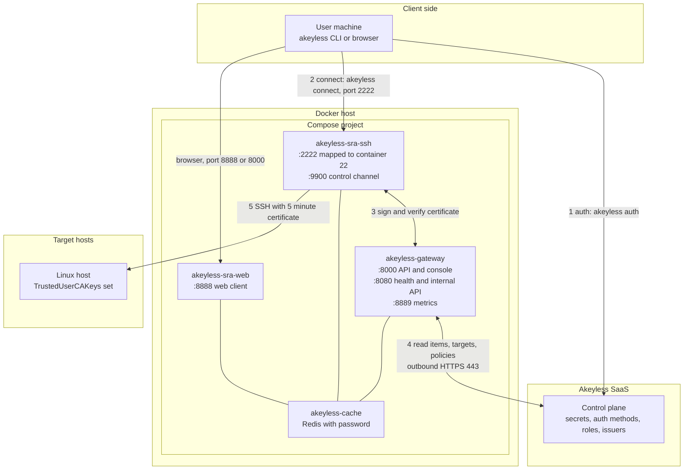
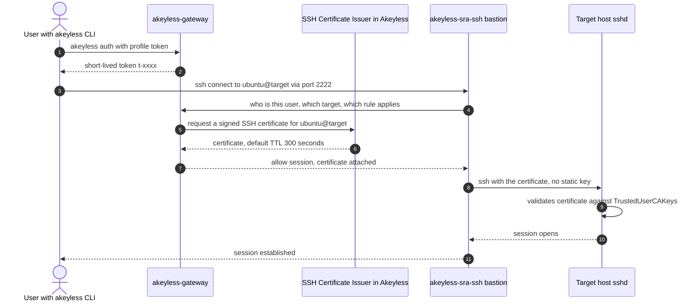

# 1. Architecture Overview

This chapter describes what the Compose kit deploys, how the pieces talk to
each other, and how a single SSH session flows through them. Read it once
before touching anything: every later chapter assumes this picture.

## Components

One Compose project, four required containers:

| Container | Image | Role | Host ports |
|---|---|---|---|
| `akeyless-gateway` | `akeyless/base:latest-akeyless` | Unified gateway: API, console, portal, HVP; the control point for SRA | 8000, 8080, 8889 |
| `akeyless-sra-ssh` | `akeyless/zero-trust-bastion:latest` | SSH bastion: terminates user SSH connections and proxies them to targets | 2222, 9900 |
| `akeyless-sra-web` | `akeyless/zero-trust-bastion:latest` | Web bastion: browser-based SSH, RDP, and web sessions | 8888 |
| `akeyless-cache` | `redis:8.2.2-alpine` | Redis cache; a hard dependency for SRA, holds session and approval state | 127.0.0.1:6379 |

Two more containers are available behind the `metrics` profile: `prometheus`
on 9090 and `grafana` on 3000. Chapter 9 covers them.

## How the pieces connect

Three facts about this layout matter for later chapters:

1. The gateway holds outbound HTTPS to the Akeyless SaaS only. No inbound
   hole from the internet to the SaaS is needed.
2. Redis is a hard dependency for SRA, not an optimization. Without it the
   SRA services cannot hold session state. The Compose file binds it to
   `127.0.0.1` only and drops all Linux capabilities.
3. Target hosts run zero Akeyless software. They trust one CA public key in
   `sshd_config`, exactly as they would trust any other certificate
   authority.

## How one SSH session flows

The certificate lives for the TTL of the issuer, five minutes by default in
this runbook. Nothing is stored on the user's machine that works tomorrow.

## Port inventory

Every port the deployment uses, with its consumer and direction:

| Port | Protocol | Exposed to | Purpose |
|---|---|---|---|
| 8000 | HTTP | Your users, your network only | Gateway API v1 and v2, `/console`, `/sra/portal`, `/hvp`, KMIP |
| 8080 | HTTP | Your network, or localhost | Gateway health endpoint `/health` and internal API |
| 8889 | HTTP | Your network, or localhost | Gateway Prometheus metrics |
| 2222 | SSH | Your users | SSH bastion, mapped to container port 22 |
| 9900 | HTTP | Gateway, host optional | SSH bastion control channel used by the gateway |
| 8888 | HTTP | Your users | Web bastion: browser SSH, RDP, web sessions |
| 6379 | RESP | 127.0.0.1 only | Redis cache |
| 9090 | HTTP | Your network | Prometheus, metrics profile only |
| 3000 | HTTP | Your network | Grafana, metrics profile only |

Outbound from the Docker host:

| Destination | Port | Purpose |
|---|---|---|
| Akeyless SaaS for your account region | 443 TCP | Gateway to control plane |
| Docker Hub or your mirror | 443 TCP | Image pulls |
| DNS and NTP for your network | 53, 123 | Name resolution and time sync; certificate validation needs correct clock |

## What this deployment does not include

This runbook deploys plain HTTP on the host ports. The public
`console.akeyless.io` cannot manage a plain-HTTP gateway, so you use the
local console on port 8000. When you need TLS, chapter 10 covers enabling it
on the gateway. Restricting ports 8000, 2222, and 8888 to your management
network is a firewall decision made in chapter 2.

## Next step

[Chapter 2: Prerequisites](02-prerequisites.md) sizes the host and lists every
requirement with verification commands.
