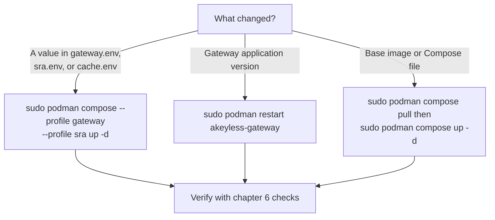

# 9. Day-2 Operations, Podman Stream

The stack is running; this chapter covers the recurring work: changing
configuration, upgrading, reading logs, and collecting metrics.

## Which operation for which change



## Changing configuration

Environment files are read at container start. After editing any of them:

```bash
sudo podman compose --profile gateway --profile sra up -d
```

Compose recreates only the services whose environment changed. Bastion
sessions in flight when the SSH bastion restarts are dropped; schedule
accordingly.

One pairing must never drift: `CLUSTER_NAME` and `GATEWAY_ACCESS_ID`
together form the gateway identity in the account. Changing one without the
other makes the console show a new gateway or none at all.

## Upgrading

The gateway fetches its application version at startup. To take a new
application version:

```bash
sudo podman restart akeyless-gateway
```

To move to a new base image, which is what a changed Compose image tag or an
upstream image update needs:

```bash
sudo podman compose pull
sudo podman compose --profile gateway --profile sra up -d
```

To upgrade deliberately rather than on every restart, pin the version: set
`VERSION` in `gateway.env` to a specific tag, and apply it with the pull
sequence above. The rest of the stack upgrades only through image pulls,
because the bastion and cache images carry no application version variable.

## Starting after a host reboot

The Compose file sets `restart: always` on every service, and Podman honors
those policies only through `podman-restart.service`, enabled in chapter 2.
After a reboot, verify the service ran:

```bash
systemctl is-active podman-restart.service
sudo podman ps --format 'table {{.Names}}\t{{.Status}}'
```

**Expected output:** `active`, then the four containers from chapter 6. If
the service is inactive, rerun the `systemctl enable --now` command from
chapter 2 and start the stack with the chapter 6 start command.

## Tearing down

```bash
sudo podman compose --profile gateway --profile sra down
```

This removes the containers and, when nothing else uses them, the networks.
If you attached a container that the Compose file does not define, for
example a test target connected to `internal-net` by hand, the command prints
`Network ... Resource is still in use` and leaves the networks in place. That
warning is harmless: the stack containers are still removed, and the next
`up` reuses the networks as they are.

## Logs

Both bastion services ship with `DEBUG: true` in the Compose file, which
gives verbose session-level logging. The useful views:

```bash
sudo podman logs --tail 100 akeyless-gateway
sudo podman logs --tail 100 akeyless-sra-ssh
sudo podman logs --tail 100 akeyless-sra-web
```

Follow live with `-f`. The gateway log carries authentication decisions
against the account; the bastion logs carry per-session connection attempts,
certificates issued, and target connection results. Keep the flag before the
container name; chapter 2 explains why.

## Metrics

The Compose file ships a Prometheus configuration that scrapes the gateway
metrics port on the internal metrics network.

1. In `gateway.env`, set `ENABLE_METRICS="true"`.
2. Start the metrics stack:

```bash
sudo podman compose --profile gateway --profile sra --profile metrics up -d
```

3. Open Prometheus at `http://sra.example.internal:9090` and confirm the
   `akeyless-gateway` target is up on the Status, Targets page.
4. Open Grafana at `http://sra.example.internal:3000`, default sign-in
   `admin` and `admin`, and add a Prometheus data source pointing at
   `http://prometheus:9090`. Then build dashboards against gateway metrics.

Grafana state survives restarts through the `grafana_data` volume, so the
default password change and dashboards persist.

## Backups and state

The deployment holds no secrets on the container host beyond the environment
files: the gateway is a stateless proxy of the account, and Redis holds only
cache and session state. Protect the environment files, they contain the
gateway credentials, and you can rebuild everything else from this repository
and the account.

## Next step

[Chapter 10: Advanced Configuration](../common/10-advanced-configuration.md)
for TLS, keepalives, host key persistence, and regional endpoints.
